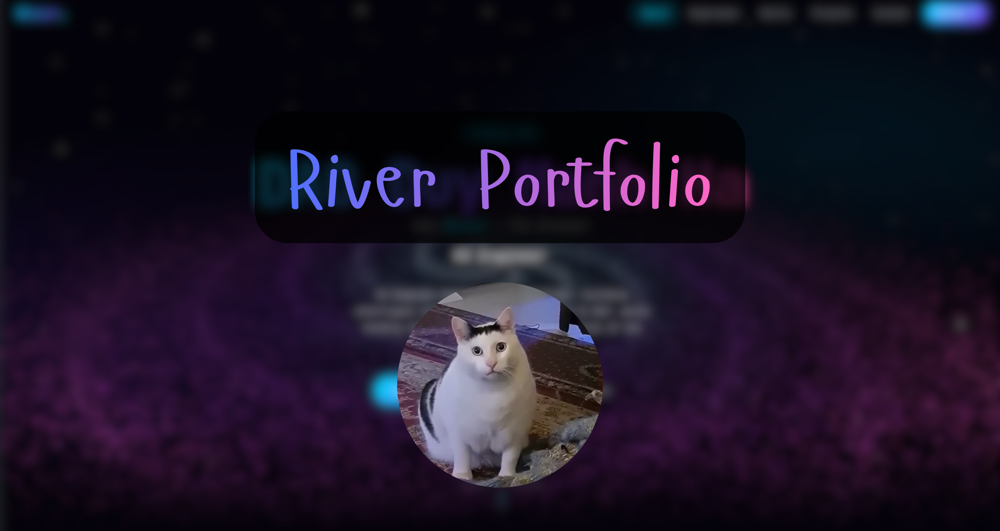

# Rêveur | Personal Portfolio & Blog 🌌

<p align="center">
  
</p>

A modern, fast, and visually stunning personal portfolio and blog built with **Next.js**, **React**, **Three.js**, and **Content Collections**.

## 🚀 Features

- **Astronomical Aesthetics:** Beautiful glassmorphism, glowing gradients, and animated star particles.
- **Markdown Blog:** Write posts in Markdown/MDX with frontmatter. Fully typed and validated using Zod.
- **Static Export:** Optimized for free hosting on GitHub Pages using Next.js `output: 'export'`.
- **Responsive Design:** Looks great on desktops, tablets, and mobile devices.

## 🛠️ Tech Stack

- **Framework:** Next.js (App Router)
- **Styling:** CSS Modules & Variables, Tailwind CSS (disabled on homepage, kept for potential future use)
- **Animations:** Framer Motion
- **3D Graphics:** Three.js / React Three Fiber
- **Content:** Content Collections (`@content-collections/core`)

## 📝 Blog Authoring Guide

Please refer to the [**BLOG_GUIDE.md**](./BLOG_GUIDE.md) file for comprehensive instructions on how to write, format, and publish new blog posts (including how to add images and code blocks).

## 💻 Local Development

1. Clone the repository:
```bash
git clone https://github.com/r1verrdao/portfolio.git
cd portfolio
```

2. Install dependencies:
```bash
npm install
```

3. Run the development server (with Turbopack for ultra-fast compilation):
```bash
npm run dev --turbo
```

4. Open [http://localhost:3000](http://localhost:3000) in your browser.

## 🌐 Deployment

This project uses **GitHub Actions** to automatically build and deploy to GitHub Pages whenever changes are pushed to the `main` branch. 

To deploy a new change or blog post:
```bash
git add .
git commit -m "feat: your commit message"
git push
```
The site will be live at `https://r1verrdao.id.vn` shortly after the pipeline finishes.
